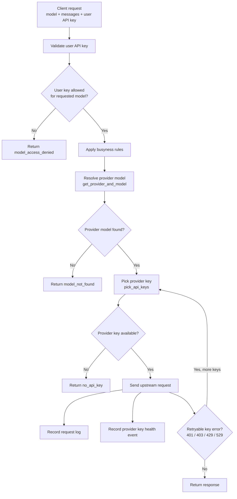
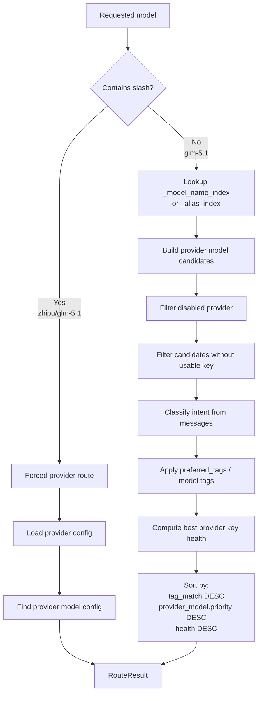
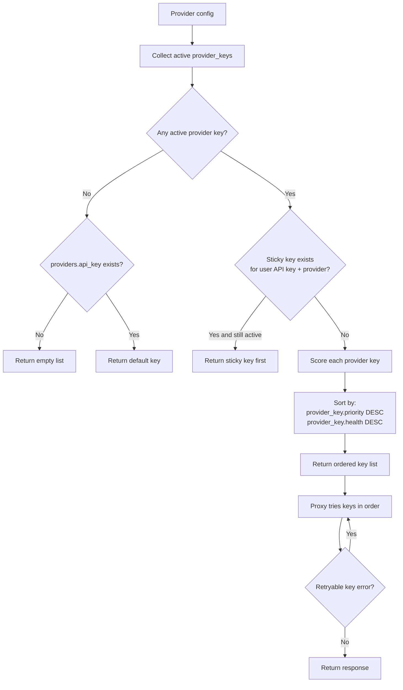
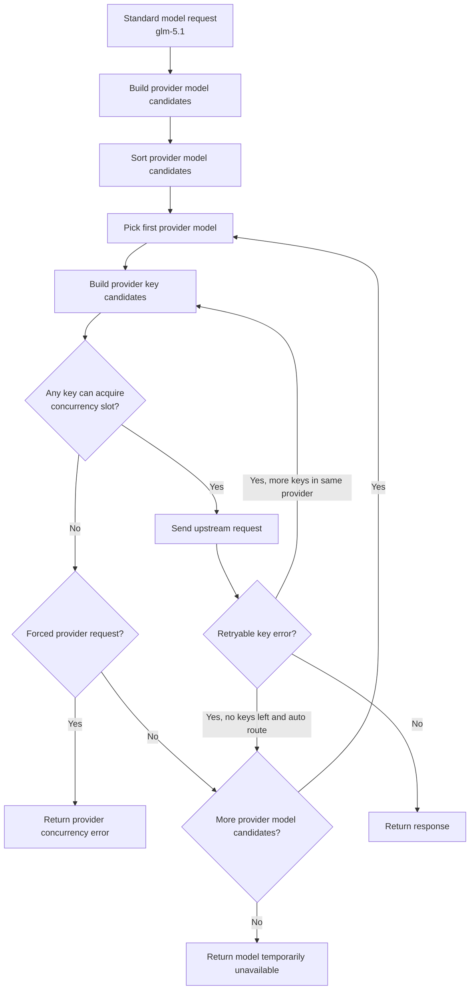
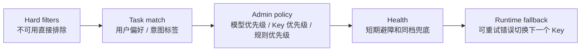
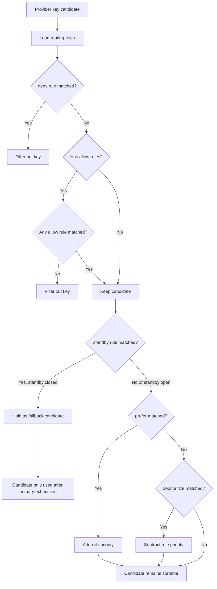
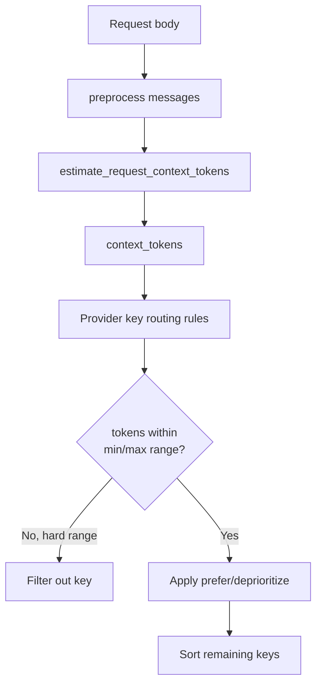
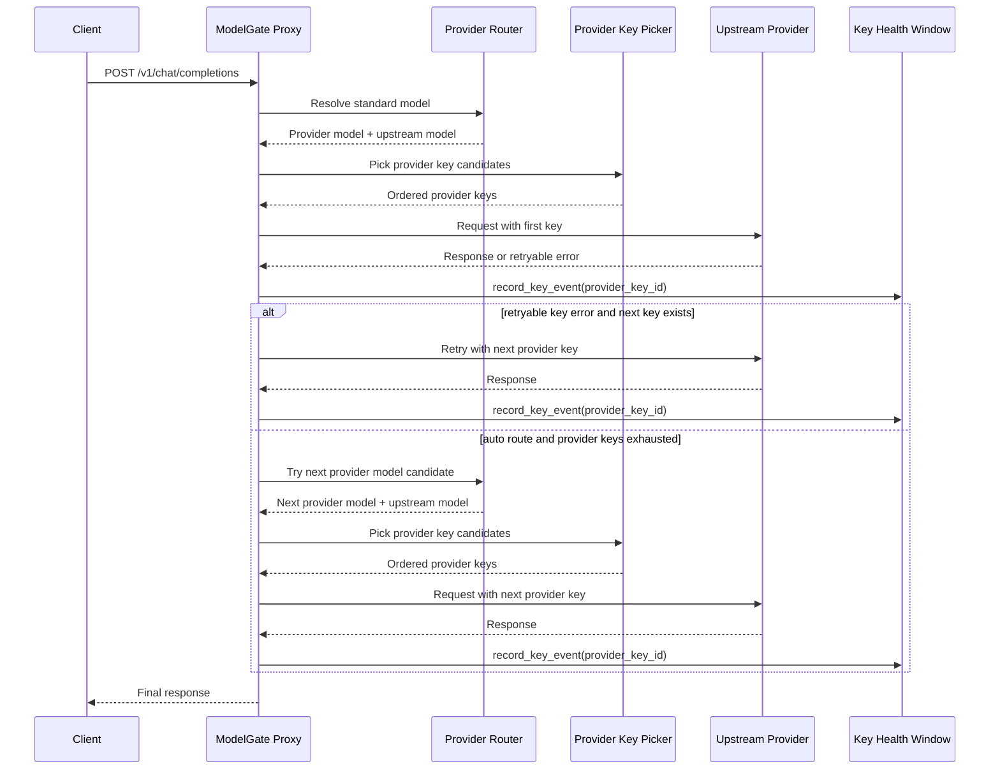
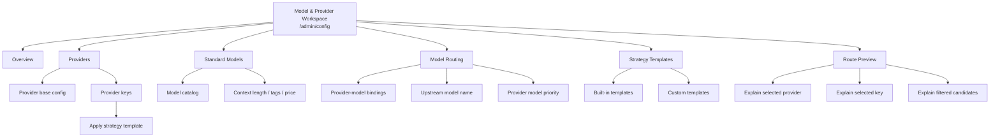
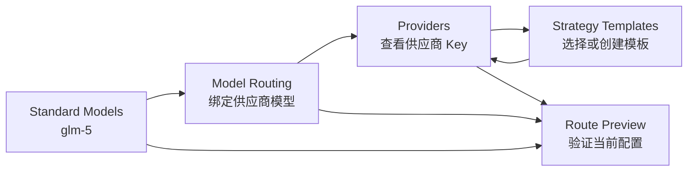

# Provider Key Health and Routing Design

日期：2026-06-13

## 背景

当前 ModelGate 已经支持同一个标准模型绑定多个供应商模型，例如 `glm-5.1` 可以同时绑定到智谱和金投。用户调用标准模型名时，系统会自动选择一个供应商模型，再从该供应商下选择一个厂商 Key 发起上游请求。

这块逻辑同时受四类因素影响：

- 供应商模型优先级：`provider_models.priority`
- 厂商 Key 优先级：`provider_keys.priority`
- 厂商 Key 健康度：`app/services/key_health.py`
- 用户 API Key 的访问控制和偏好：模型权限、时间规则、`preferred_tags`

旧文档 [docs/V2_DESIGN.md](../V2_DESIGN.md) 已经描述过 Key 健康度和智能路由，但其中部分排序规则已经落后于当前代码，例如旧文档写的是 `health > priority`。当前期望是：手工配置的优先级应该表达明确运营策略，health 用来兜底和避开异常 Key，而不是压过所有人工配置。

## 当前实现事实

### 总体链路图



这张图是当前代码的真实主链路：先做用户 API Key 校验，再选供应商模型，再选厂商 Key。health 事件应该记录到厂商 Key，而不是用户 API Key。

当前代码的一个重要边界是：供应商模型一旦选定，后续只会在该供应商内按 Key 列表 fallback。如果该供应商下所有 Key 都因为并发满、限流或可重试错误不可用，当前实现不会继续尝试另一个同标准模型的供应商模型。

### 数据模型

供应商：

- `providers.api_key`：旧的供应商默认 Key，仍可作为 fallback。
- `providers.disabled_reason`：供应商级禁用原因；非空时该供应商不参与自动路由。

厂商 Key：

- `provider_keys.api_key`：具体上游 Key。
- `provider_keys.is_active`：是否可用。
- `provider_keys.priority`：同一供应商内 Key 的手工优先级，数值越大越优先。
- `provider_keys.max_concurrent`：单 Key 并发上限。
- `provider_keys.disabled_reason` / `disabled_at` / `reset_at`：自动禁用和恢复相关状态。

供应商模型：

- `provider_models.model_id`：绑定标准模型。
- `provider_models.upstream_model_name`：真正发给上游的模型名。
- `provider_models.priority`：同一标准模型下供应商模型的手工优先级，数值越大越优先。
- `provider_models.max_busyness_level`：忙碌等级限制。

用户 API Key：

- `api_key_model_access`：按标准模型授权。
- `api_key_models`：按供应商模型授权。
- `api_key_time_rules`：当前用于限制用户 API Key 在某些时间、日期、星期是否可用，不是厂商 Key 选择策略。
- `api_keys.preferred_tags`：用于影响供应商模型标签匹配。

### Health 评分

当前 health 是进程内 5 分钟滑动窗口，不落库。

事件来源：

- normal 请求成功或失败后记录到 `chosen_key_id`
- stream 请求成功、失败、取消时记录到 `chosen_key_id`
- internal 调用成功或失败后记录到 `chosen_key_id`
- Key 被自动禁用时记录 `disabled`

评分规则：

| 事件 | 影响 |
|---|---|
| Key 非 active | 直接返回 0 |
| `disabled` 事件 | 直接返回 0 |
| 429 / 529 | 每次扣 15 |
| 5xx | 每次扣 10 |
| 其他 4xx | 每次扣 5 |
| 成功 | 每 10 次成功加 5，最高不超过 100 |

等级：

| 分数 | 等级 |
|---|---|
| 90-100 | excellent |
| 60-89 | good |
| 30-59 | warning |
| 1-29 | critical |
| 0 | unavailable |

实时性判断：

- 单进程内实时：请求结束后立即影响该进程内 health。
- 重启会清空：事件只存在内存里。
- 多 worker / 多容器不共享：每个进程看到的 health 可能不同。
- 当前 Docker 启动方式是 `python -m app.main`，单进程运行，因此现阶段实时性可接受。

### 自动路由：标准模型到供应商模型

入口：`app/services/provider.py:get_provider_and_model()`



路由过程：

1. 如果请求模型包含 `/`，例如 `zhipu/glm-5.1`，走显式供应商路径。
2. 如果请求模型不包含 `/`，例如 `glm-5.1`，走标准模型或别名索引。
3. 从 `_model_name_index` 或 `_alias_index` 找到候选供应商模型。
4. 过滤掉以下候选：
   - 供应商不存在
   - 供应商有 `disabled_reason`
   - 没有 active provider key 且没有 `providers.api_key`
5. 计算 `tag_match`：
   - `2`：用户 API Key 的 `preferred_tags` 命中模型 tags
   - `1`：请求内容意图命中模型 tags
   - `0`：无标签命中
6. 每个候选取该供应商 active Key 的最高 health；只有默认 Key 时按 100 处理。
7. 排序：`tag_match DESC, provider_model.priority DESC, provider_key_health DESC`
8. 选择第一名。

这个顺序表达的含义是：

- 用户偏好和模型标签先决定大方向。
- 供应商模型优先级表达管理员的明确运营选择。
- health 只在同标签、同供应商模型优先级时做兜底。

### 自动路由：供应商内选择厂商 Key

入口：`app/services/provider.py:pick_api_keys()`



当前过程：

1. 收集该供应商下 active 的 `provider_keys`。
2. 如果没有 active Key，则 fallback 到 `providers.api_key`。
3. 如果仍无 Key，返回空，主请求返回“供应商无可用 API Key”。
4. 如果该用户 API Key 在当前供应商上有 sticky Key 且未过期，优先返回 sticky Key。
5. 否则排序：`provider_key.priority DESC, provider_key.health DESC`
6. 按排序结果依次尝试，遇到可重试的 Key 错误时 fallback 到下一个 Key。

sticky 设计：

- key：`(user_api_key_id, provider_name)`
- value：`(provider_key_id, timestamp)`
- TTL：30 分钟

sticky 的目的不是“永远固定”，而是减少同一个用户在短时间内频繁切换上游 Key，降低上游会话、限流、账单观测的抖动。

### 当前并发处理边界

当前并发控制分三层：

- 用户 API Key 总并发：限制单个用户 Key 的整体并发。
- 用户 API Key + 供应商模型并发：限制单个用户 Key 在某个供应商模型上的并发。
- 厂商 Key 并发：来自 `provider_keys.max_concurrent`，限制单个上游 Key 的并发。

当前行为：

1. 先选出一个供应商模型。
2. 在该供应商内按 Key 排序得到候选 Key 列表。
3. 如果某个厂商 Key 并发满，且该供应商还有下一个 Key，则尝试下一个 Key。
4. 如果该供应商内所有 Key 都不可用或并发满，返回当前供应商的并发错误。
5. 不会回到供应商模型候选池，尝试另一个同标准模型供应商。

这个行为对显式调用是合理的：

- 用户请求 `zhipu/glm-5.1` 时，含义是明确指定智谱。
- 如果智谱并发满，返回智谱不可用比偷偷切到金投更符合预期。

但对自动路由不够理想：

- 用户请求 `glm-5.1` 时，表达的是“我要这个标准模型”。
- 如果金投当前并发满，而智谱也绑定了 `glm-5.1` 且可用，系统应该可以尝试智谱。

因此建议后续把“供应商内 Key fallback”提升为“两级 fallback”：



推荐规则：

- 显式供应商请求：只在该供应商内换 Key，不跨供应商。
- 标准模型自动路由：允许跨供应商模型 fallback。
- 用户 API Key 总并发满：不能跨供应商解决，直接返回用户并发限制。
- 用户 API Key + 供应商模型并发满：自动路由时可以尝试下一个供应商模型；显式供应商时返回并发限制。
- 厂商 Key 并发满：先尝试同供应商其他 Key；没有可用 Key 时，自动路由尝试下一个供应商模型。

## 现有问题和边界

### Health 只适合做短期避障

当前 health 是 5 分钟内存窗口，适合回答“这个 Key 刚才是不是异常”。它不适合做长期质量判断，也不适合跨进程全局调度。

如果未来部署多 worker 或多容器，需要引入共享事件存储，例如 Redis 或数据库表。否则 A 进程看到 Key A 很健康，B 进程可能完全不知道 Key A 刚被限流。

### 默认 Key 无法精确 health

`providers.api_key` 没有独立 id，因此无法记录独立 health。当前默认按 100 处理。建议后续逐步迁移到 `provider_keys` 表，默认 Key 只保留兼容。

### 用户 API Key 时间规则不是厂商 Key 路由规则

现有 `api_key_time_rules` 是“这个用户 Key 此时是否允许请求”的规则。用户提到的“某个时间段优先使用哪个厂商 Key”是另一类规则，应该挂在 provider key 或 provider-model-provider-key 关系上，不能复用 `api_key_time_rules`。

## 推荐目标设计

### 总体原则

路由应分两层决策：

1. 先选供应商模型：决定请求走哪个供应商、哪个上游模型名。
2. 再选供应商 Key：决定该供应商内使用哪个上游 Key。

两层都需要有“硬过滤”和“软排序”。

硬过滤用于排除不可用候选：

- disabled provider
- disabled provider key
- 用户 API Key 无权限
- 当前时间不允许
- 上下文长度不满足
- 并发满且无可用 fallback

软排序用于在可用候选里选最优：

- tag match
- 手工优先级
- health
- 成本、延迟等未来指标



### 供应商模型选择顺序

建议保持当前顺序：

```text
tag_match DESC
provider_model.priority DESC
best_provider_key_health DESC
```

理由：

- `tag_match` 表示用户或系统对任务类型的明确偏好，应最先考虑。
- `provider_model.priority` 是管理员配置的运营策略，应优先于短期 health。
- `health` 是同优先级下的避障指标。

当某个供应商 health 降到 0 或全部 Key 被禁用时，它会在硬过滤阶段被排除，而不是只靠排序降低权重。

### 供应商 Key 选择顺序

当前顺序是：

```text
sticky 命中优先
provider_key.priority DESC
provider_key.health DESC
```

建议下一阶段演进为：

```text
hard filters:
  is_active
  time_policy matches
  context_policy matches
  available concurrency

soft sorting:
  sticky bonus
  provider_key.priority DESC
  policy_specific_priority DESC
  provider_key.health DESC
```

这里建议把 sticky 从“绝对优先”改成“加分项”或“同档优先”。否则当 sticky Key 在新策略下不适合当前请求，例如上下文太长或处于禁用时间段，可能会挡住更合适的 Key。

## 未来需求：按时间段选择 Key

需求示例：

- 晚上 20:00-23:00 优先使用 Key A。
- 工作日白天优先使用 Key B。
- 某 Key 只允许在低峰期使用。

更贴近实际运营的场景是“按时间 + 上下文大小 + 成本 + 并发压力分流”，例如：

- 早上希望大部分 `glm-5` 流量优先走智谱，因为默认质量和成本更合适。
- 早高峰智谱可能触及并发上限，因此小上下文请求可以分流到金投的 `glm-5`。
- 智谱 Key 是套餐 Key，平常时间段容量足够，优先使用。
- 下午智谱套餐的计费方式或消耗倍率翻倍，可能更快触及 5 小时套餐限制，因此允许一部分流量走另一个按 token 计费的 `glm-5` 供应商。
- 这个按 token 计费的供应商平常不开放，只在特定时间段作为成本受控分流，或在套餐 Key 停用、不可用、并发耗尽时作为应急兜底候选。

这个需求不能只建模成“时间段内固定使用某个 Key”。它更像是 provider key / provider model 的动态候选策略：某些候选在特定时间段被允许进入候选池，某些候选在小上下文时提高优先级，某些候选只在主供应商并发紧张或高峰成本过高时才参与。

建议新增 provider key 维度的路由规则，而不是复用用户 API Key 时间规则。

建议表结构：

```sql
CREATE TABLE provider_key_routing_rules (
    id SERIAL PRIMARY KEY,
    provider_key_id INTEGER NOT NULL REFERENCES provider_keys(id) ON DELETE CASCADE,
    rule_type VARCHAR(30) NOT NULL,
    enabled BOOLEAN DEFAULT TRUE,
    priority INTEGER DEFAULT 0,
    start_time TIME,
    end_time TIME,
    start_date DATE,
    end_date DATE,
    weekdays VARCHAR(20),
    min_context_tokens INTEGER,
    max_context_tokens INTEGER,
    action VARCHAR(20) NOT NULL DEFAULT 'prefer',
    created_at TIMESTAMP DEFAULT now()
);
```

`action` 建议支持：

| action | 含义 |
|---|---|
| `allow` | 命中才允许使用 |
| `deny` | 命中时禁止使用 |
| `prefer` | 命中时提高排序 |
| `deprioritize` | 命中时降低排序 |
| `standby` | 默认不参与；仅在主候选并发满、health 不可用或高峰分流条件命中时参与 |

规则优先级：

1. `deny` 命中：硬排除。
2. 如果某 Key 配了 `allow` 规则：必须至少命中一条 allow。
3. `standby` 默认不进入候选池，除非请求上下文满足 standby 条件，或主候选因为并发、health、限流不可用。
4. `prefer` / `deprioritize` 只影响排序，不改变可用性。

跨午夜时间段沿用现有时间规则语义：

- `start_time <= end_time`：当天区间。
- `start_time > end_time`：跨午夜区间，例如 22:00-02:00。



### 场景建模示例：早晚高峰 glm-5 分流

假设同一个标准模型 `glm-5` 有三个供应商模型：

| 供应商 | 用途 | 默认状态 |
|---|---|---|
| 智谱 glm-5 | 主力供应商 | 常开，默认优先 |
| 金投 glm-5 | 小上下文分流 | 常开，但只在小上下文或智谱并发紧张时提高优先级 |
| token 计费供应商 glm-5 | 下午高峰分流 | 平常 standby，不开放常规流量 |

推荐规则表达：

```text
智谱 glm-5:
  provider_model.priority = 100
  provider_key.priority = 100
  常规主路由

金投 glm-5:
  provider_model.priority = 80
  provider_key.priority = 80
  prefer when:
    time_range = 08:00-11:00
    max_context_tokens = 8000
  standby/fallback when:
    智谱 provider key concurrency exhausted

token 计费供应商 glm-5:
  provider_model.priority = 60
  provider_key.priority = 60
  standby by default
  allow/prefer when:
    time_range = 13:00-18:00
    traffic_split or overflow enabled
  deny outside:
    13:00-18:00
```

这个例子里，上午小上下文请求可以被金投吸收，避免智谱被小请求占满；下午高峰时，按 token 计费供应商才进入候选池承接一部分流量。平常它不会被选中，即使 health 很高，也不能绕过 `standby` / `allow` 规则。

### 分流策略需要表达“开放条件”

后续实现时，建议规则不仅支持时间和上下文，还支持候选开放条件：

| 条件 | 含义 |
|---|---|
| `always` | 总是参与候选 |
| `time_window` | 仅在时间段内参与 |
| `context_range` | 仅在上下文 token 区间内参与 |
| `primary_concurrency_exhausted` | 主候选并发满后才参与 |
| `primary_health_below` | 主候选 health 低于阈值后才参与 |
| `primary_disabled_or_unavailable` | 主套餐 Key 停用、被自动禁用、无可用 Key 时参与 |
| `cost_multiplier_window` | 主套餐 Key 处于高倍率成本窗口时参与 |
| `traffic_split` | 在指定时间段内按比例参与 |

`traffic_split` 可以后置实现。第一版可以先做 deterministic 的 `allow / deny / prefer / standby`，等路由解释和日志稳定后，再引入按比例分流。

### 套餐 Key 与按量 Key 的成本策略

这里建议把 Key 分成不同成本角色，而不是只靠 priority 表达：

| 成本角色 | 说明 | 路由策略 |
|---|---|---|
| `package_primary` | 套餐 Key，平常容量充足，边际成本低 | 默认优先 |
| `package_peak_limited` | 套餐 Key 在特定时间段消耗倍率升高，容易触及套餐限制 | 高峰期降低优先级或限制大上下文 |
| `metered_standby` | 按 token 计费 Key，成本可控但不希望常态使用 | 默认 standby，只在高峰、主 Key 停用或 overflow 时开放 |

推荐第一版不要直接做复杂成本计算，而是用规则表达成本窗口：

```text
智谱套餐 Key:
  cost_role = package_primary
  priority = 100
  normal window:
    00:00-13:00, 18:00-24:00
    prefer
  peak multiplier window:
    13:00-18:00
    deprioritize large context

按量计费 Key:
  cost_role = metered_standby
  priority = 60
  standby by default
  open when:
    primary_disabled_or_unavailable
    or primary_concurrency_exhausted
    or cost_multiplier_window = 13:00-18:00
  optional guard:
    max_context_tokens = 16000
    traffic_split = 20%
```

这样可以保证：

- 平常优先消耗套餐 Key。
- 下午高倍率窗口不会把所有流量硬塞给套餐 Key。
- 套餐 Key 被禁用、过期、达到上游限制或无可用 Key 时，按量 Key 可以自动放出来兜底。
- 按量 Key 的使用是有边界的，可以通过时间段、上下文长度和分流比例控制成本。

## 未来需求：按上下文长度选择 Key

需求示例：

- 上下文大于 64k 优先使用长上下文 Key。
- 上下文小于 8k 优先使用低成本 Key。
- 某些 Key 不支持超过 32k 的请求。

当前已有 `estimate_request_context_tokens(req_body)`，可在请求预处理后得到估算上下文 token 数。

建议策略：

- `min_context_tokens` / `max_context_tokens` 支持硬过滤。
- `prefer` 支持在某个区间内加权。
- 上下文规则应作用于 provider key 选择阶段，而不是供应商模型选择阶段。

原因是同一个供应商模型下，不同 Key 可能连接不同账号、套餐或网关能力。标准模型和上游模型不一定能表达这些差异。



## Health 与策略的先后关系

推荐裁决顺序：

```text
1. 硬过滤
   - provider disabled
   - provider key inactive
   - user api key has no model access
   - time deny / allow mismatch
   - context deny / allow mismatch
   - no available key

2. 任务匹配
   - preferred_tags
   - intent tags

3. 管理员策略
   - provider_model.priority
   - provider_key.priority
   - matched routing rule priority

4. 健康度
   - provider key health

5. 运行时兜底
   - key fallback on 401/403/429/529
   - provider-model fallback on key concurrency exhausted
   - auto-disable invalid/quota-exceeded key
```

也就是说，health 不应该压过明确策略；但 health 为 0、Key 禁用、错误可重试时，必须触发避障。



## API 和页面建议

### Provider Key 配置

在供应商配置页面的 Key 列表中明确展示：

- Key priority
- health score 和 5 分钟事件
- max concurrent
- routing rules 数量或摘要

### 页面配置设计

当前 `admin/config` 的 Provider Keys 是弹窗列表：每个 Key 行内编辑 label、并发、priority、health、启停和删除。路由策略如果直接塞进这一行，会让列表不可读。因此建议采用“列表保持轻量，策略进入右侧抽屉”的配置方式。

HTML 原型：[docs/prototypes/provider-key-routing-config-prototype.html](../prototypes/provider-key-routing-config-prototype.html)

### 模型与供应商工作台

供应商配置、模型配置、供应商绑定模型、供应商 Key、Key 策略模板不建议拆成多个侧边栏页面，也不建议继续堆在一个长页面里。推荐做成一个“模型与供应商”工作台，在一个页面内用 tabs 组织。

原因：

- 这几类配置高度关联。配置一次 `glm-5` 分流策略时，经常需要同时看标准模型、供应商模型绑定、供应商 Key 和策略模板。
- 如果拆成多个侧边栏页面，管理员会频繁跳转，且上下文容易丢失。
- 如果继续放在一个大页面里，`config.html` 会继续膨胀，策略规则加入后更难维护。

推荐 URL：

```text
/admin/config?tab=overview
/admin/config?tab=providers
/admin/config?tab=models
/admin/config?tab=routing
/admin/config?tab=strategy-templates
/admin/config?tab=route-preview
```

页面结构：



#### Tab 职责

| Tab | 主要对象 | 职责 | 不负责 |
|---|---|---|---|
| 概览 | 系统状态 | 展示异常供应商、低 health Key、无可用供应商的模型、热点路由摘要 | 不做复杂编辑 |
| 供应商 | Provider / ProviderKey | 管理供应商基础信息和 Key 基础信息，Key 只应用模板和填参数 | 不创建标准模型 |
| 标准模型 | Model | 管理模型目录、上下文长度、输出上限、tags、估算价格 | 不配置具体上游 Key |
| 模型路由 | ProviderModel | 配置标准模型和供应商模型的绑定、upstream model、provider model priority、忙碌等级 | 不编辑 Key 策略细节 |
| 策略模板 | StrategyTemplate | 管理内置/自定义模板，定义参数 schema 和规则 blueprint | 不绑定具体 Key |
| 路由预览 | Routing Debugger | 输入模型、时间、上下文 token，解释最终路由和过滤原因 | 不修改配置 |

#### Tab 间跳转关系



典型配置路径：

1. 在“标准模型”确认 `glm-5` 的上下文长度、tags、价格。
2. 在“模型路由”把 `glm-5` 绑定到智谱、金投、按量供应商，并配置 provider model priority。
3. 在“供应商”里给各供应商配置 Key、并发、Key priority、成本角色。
4. 在“策略模板”里维护“按量计费 standby”“小上下文优先”等模板。
5. 回到“供应商”给具体 Key 应用模板并填参数。
6. 在“路由预览”验证上午、下午、小上下文、大上下文、主 Key 停用等场景。

#### 供应商 Tab

供应商 Tab 采用 master-detail：

```text
左侧：供应商列表
右侧：供应商详情
  - 基础信息
  - Provider Keys
  - Key 策略摘要
```

Provider Key 行只显示摘要：

- label / masked key
- active / disabled reason
- cost role
- priority
- max concurrent
- health
- strategy summary chips

点击“策略”打开右侧抽屉。抽屉只让管理员选择模板并填写模板参数，不展示完整规则编辑器。

#### 标准模型 Tab

标准模型 Tab 管理平台内的标准模型目录：

- model name，例如 `glm-5`
- display name
- context length
- max output tokens
- thinking / multimodal
- tags
- estimated price

这里的 price 是标准模型展示和成本估算，不直接等于某个供应商 Key 的真实成本。套餐 Key、按量 Key 的调度成本放在 Provider Key 策略中。

#### 模型路由 Tab

模型路由 Tab 是配置自动路由的核心页，建议按标准模型分组：

```text
glm-5
  1. zhipu / glm-5
     upstream_model_name = glm-5
     provider_model.priority = 100
     max_busyness_level = ...

  2. jintou / local_model
     upstream_model_name = local_model
     provider_model.priority = 80

  3. metered / glm-5
     upstream_model_name = glm-5
     provider_model.priority = 60
     standby by key strategy
```

这个 Tab 配“哪个供应商模型参与某个标准模型的自动路由”，不配具体 provider key 的时间段、上下文和成本策略。

#### 策略模板 Tab

策略模板 Tab 管理模板库：

- 内置模板只读或有限编辑。
- 自定义模板可新增、复制、禁用。
- 模板需要显示参数 schema，例如开放开始、开放结束、上下文上限、分流比例。
- 模板需要显示生成规则预览。

第一版建议只提供内置模板，不开放复杂自定义编辑器。可以先支持“复制内置模板为自定义模板”，但高级规则编辑保持只读或 JSON 预览。

#### 路由预览 Tab

路由预览 Tab 是必要的调试工具。它应该解释“为什么选它”，而不只是显示最终结果。

输入：

- 用户 API Key 或 API Key 标签
- 标准模型
- 当前时间
- 上下文 token
- 是否模拟主 Key 停用
- 是否模拟并发耗尽

输出：

- 选中的供应商模型
- 选中的 provider key
- 候选列表排序
- 被过滤候选及原因
- 命中的策略模板和规则

示例：

```text
当前请求：glm-5, 14:30, 6000 tokens

Selected:
  provider model: zhipu / glm-5
  provider key: Zhipu package key

Candidates:
  1. zhipu package key
     usable, priority 100, health 100
     note: high multiplier window, still allowed

  2. jintou local key
     usable, small-context prefer matched

  3. metered standby key
     standby open, cost_multiplier_window matched
```

#### 代码拆分建议

当前 `web/templates/admin/config.html` 已经很大，不建议继续把 tabs、策略模板和路由预览全塞进去。UI 可以是一个页面，但代码必须拆。

建议模板结构：

```text
web/templates/admin/config.html
web/templates/admin/config_tabs/overview.html
web/templates/admin/config_tabs/providers.html
web/templates/admin/config_tabs/models.html
web/templates/admin/config_tabs/routing.html
web/templates/admin/config_tabs/strategy_templates.html
web/templates/admin/config_tabs/route_preview.html
```

建议静态 JS 结构：

```text
web/static/js/admin/config/index.js
web/static/js/admin/config/providers.js
web/static/js/admin/config/models.js
web/static/js/admin/config/routing.js
web/static/js/admin/config/strategy_templates.js
web/static/js/admin/config/route_preview.js
web/static/js/admin/config/shared.js
```

拆分原则：

- `index.js` 只负责 tab 状态、初始化和 URL query 同步。
- 每个 tab 自己加载数据、渲染内容、绑定事件。
- 共享 fetch、toast、format、badge 渲染放到 `shared.js`。
- Provider Key 策略抽屉作为共享组件，被 Providers Tab 和 Route Preview 调试入口复用。

#### 不推荐方案

不推荐拆成四个独立侧边栏入口：

```text
/admin/providers
/admin/models
/admin/provider-models
/admin/provider-key-strategies
```

这样虽然代码看起来分散，但用户配置一个完整路由策略需要在多个页面之间跳转，理解成本更高。

也不推荐保留当前一个页面三块卡片继续扩展。策略模板、路由预览和跨供应商 fallback 加进来后，当前结构会变成多层弹窗和长脚本，后续维护成本会继续升高。

推荐信息架构：

```text
Provider Keys Modal
  Key row
    - label / masked key / active state
    - cost role
    - priority / concurrency / health
    - strategy summary chips
    - actions: edit strategy, enable/disable, delete

  Strategy Drawer
    - cost role
    - strategy template
    - activation conditions
    - guards and limits
    - routing preview
    - advanced rules
```

#### Key 行

Key 行只展示运维判断必需的信息：

| 字段 | 展示方式 |
|---|---|
| Key 名称和掩码 | 主文本，保留 label |
| 状态 | active / inactive / disabled reason |
| 成本角色 | `套餐主力`、`高峰受限套餐`、`按量备用` |
| priority | 小数字输入或只读摘要 |
| max concurrent | 小数字输入或只读摘要 |
| health | score + level badge |
| 策略摘要 | chip，例如 `下午开放`、`小上下文优先`、`主 Key 不可用时兜底` |

#### 策略模板

策略配置不应默认展示原始规则表，也不应该让每个 Key 都从零配置一套规则。更合理的方式是先维护“策略模板库”，然后在某个 Provider Key 上选择模板并填写少量参数。

模板分两类：

- 内置模板：系统提供，覆盖大多数场景，不能删除，只允许配置参数。
- 自定义模板：管理员沉淀自己的运营策略，例如“下午智谱高倍率分流”。

Key 配置页面只做“应用模板”，不做复杂模板编排。模板编排放到独立页面或独立弹窗。


推荐内置模板：

| 模板 | 用途 |
|---|---|
| 始终可用 | 普通常开 Key |
| 指定时间段可用 | 只在固定时间参与候选 |
| 小上下文优先 | 小请求分流，避免主 Key 被小请求占满 |
| 高峰期分流 | 在成本或并发高峰期承接一部分流量 |
| 主 Key 不可用时备用 | 主 Key 停用、health 不可用或并发耗尽时开放 |
| 按量计费 standby | 默认不开放，只在高峰或主 Key 不可用时开放 |

模板应该是独立数据模型，而不是只在前端硬编码。应用模板后，系统保存“模板引用 + 参数快照”，同时可以生成或解释为统一的 provider key routing rules。

建议表结构：

```sql
CREATE TABLE provider_key_strategy_templates (
    id SERIAL PRIMARY KEY,
    name VARCHAR(100) NOT NULL,
    template_key VARCHAR(80) NOT NULL UNIQUE,
    description TEXT,
    is_builtin BOOLEAN DEFAULT FALSE,
    config_schema JSONB NOT NULL DEFAULT '{}'::jsonb,
    rule_blueprint JSONB NOT NULL DEFAULT '{}'::jsonb,
    created_at TIMESTAMP DEFAULT now(),
    updated_at TIMESTAMP DEFAULT now()
);

CREATE TABLE provider_key_strategy_assignments (
    id SERIAL PRIMARY KEY,
    provider_key_id INTEGER NOT NULL REFERENCES provider_keys(id) ON DELETE CASCADE,
    template_id INTEGER NOT NULL REFERENCES provider_key_strategy_templates(id),
    enabled BOOLEAN DEFAULT TRUE,
    params JSONB NOT NULL DEFAULT '{}'::jsonb,
    created_at TIMESTAMP DEFAULT now(),
    updated_at TIMESTAMP DEFAULT now()
);
```

`config_schema` 定义模板需要哪些参数，例如：

```json
{
  "fields": [
    {"key": "start_time", "type": "time", "label": "开放开始"},
    {"key": "end_time", "type": "time", "label": "开放结束"},
    {"key": "max_context_tokens", "type": "number", "label": "上下文上限"}
  ]
}
```

`rule_blueprint` 定义模板如何翻译成路由规则。第一版可以只支持内置模板，先不开放自定义模板编辑器，但数据模型要留出空间。

#### 策略抽屉

策略抽屉建议分为五块：

1. 成本角色：选择 `package_primary`、`package_peak_limited`、`metered_standby`。
2. 策略模板：从模板库选择一个模板。
3. 开放条件：时间段、主 Key 不可用、主 Key 并发耗尽、health 低于阈值。
4. 使用限制：上下文 token 上限、流量比例、最大并发。
5. 路由预览：用当前时间和样例上下文展示候选排序与过滤原因。

如果选择内置模板，抽屉只显示该模板暴露出来的参数。不要显示所有可能的条件。比如：

- “小上下文优先”只显示时间段、上下文上限、命中后优先级。
- “按量计费 standby”只显示开放条件、上下文上限、分流比例。
- “主 Key 不可用时备用”只显示主 Key 选择、health 阈值、并发耗尽开关。

#### 路由预览

路由预览是这个页面的关键。管理员配置完策略后，需要立即看到它对实际路由的影响：

```text
现在调用 glm-5，预计顺序：
1. 智谱套餐 Key，主力，health 100，并发 2/5
2. 金投 Key，小上下文分流，health 100
3. 按量 Key，standby，当前未开放，原因：不在 13:00-18:00，主 Key 正常
```

预览应支持最少三个输入：

- 模型：默认当前供应商模型或标准模型。
- 当前时间：默认系统当前时间，可手动切换上午/下午。
- 上下文 token：默认估算值，可手动输入。

#### 高级规则

高级规则放在折叠区。普通配置不需要碰它。高级区用于展示或编辑最终规则：

- `allow`
- `deny`
- `prefer`
- `deprioritize`
- `standby`

这样既能覆盖复杂场景，又不会让普通管理员一上来面对规则引擎。

第一版甚至可以只读展示高级规则，不允许编辑。这样能降低实现复杂度，也避免管理员绕过模板造成不可解释的配置。

### Key 路由规则管理

每个 provider key 增加“路由规则”配置区域：

- 时间段规则
- 星期规则
- 日期规则
- 上下文 token 区间
- action：allow / deny / prefer / deprioritize
- priority：命中后的规则优先级

### 调试接口

建议新增调试接口：

```text
POST /admin/api/routing/resolve
```

输入：

```json
{
  "model": "glm-5.1",
  "api_key_id": 12,
  "messages": [{"role": "user", "content": "..."}]
}
```

输出：

```json
{
  "selected_provider": "jintou",
  "selected_provider_model_id": 16,
  "selected_provider_key_id": 4,
  "context_tokens": 12000,
  "candidates": [
    {
      "provider": "jintou",
      "provider_model_id": 16,
      "provider_model_priority": 2,
      "provider_key_id": 4,
      "provider_key_priority": 10,
      "health": 100,
      "matched_rules": ["weekday-work-hours"],
      "filtered_reason": null
    }
  ]
}
```

这个接口比只看最终日志更有价值，可以解释“为什么选了这个供应商/Key”。

## 实施建议

第一阶段：文档和当前逻辑收敛

- 更新旧文档中 `health > priority` 的过期描述。
- 保持当前代码：供应商模型按 `tag_match, priority, health`。
- 保持当前代码：供应商 Key 按 `priority, health`。
- 确认 health 事件只记录 provider key id。

第二阶段：抽象 Key 选择器

- 新增 `ProviderKeyCandidate` 数据结构。
- 将 `pick_api_keys()` 从简单排序改为“硬过滤 + 打分解释”。
- 保留当前返回格式，避免一次性改动 proxy 主流程。
- 明确返回 Key 不可用原因，例如 `concurrency_exhausted`、`time_denied`、`context_exceeded`、`health_unavailable`。

第三阶段：Provider Key 路由规则

- 新增 `provider_key_routing_rules` 表。
- 在 `load_providers()` 时加载到 provider cache。
- 在 Key 选择器里执行时间和上下文规则。
- 增加 Admin 配置页面和 API。

第四阶段：跨供应商 fallback

- 将 `get_provider_and_model()` 的单一结果扩展为候选列表，或新增 `get_provider_model_candidates()`。
- proxy 主流程按供应商模型候选顺序尝试。
- 显式供应商请求保持只尝试指定供应商。
- 自动路由请求在 provider key 并发耗尽、可重试 key 错误耗尽时，尝试下一个供应商模型。
- 日志记录最终选中的 provider/model/key，同时可选记录被跳过候选的原因。

第五阶段：调试和观测

- 新增 routing resolve 调试接口。
- request log 增加可选的 routing decision 摘要。
- 如果部署多进程，再把 health 事件移到 Redis 或数据库。

## 测试要求

必须覆盖：

- provider model priority 高于 health。
- provider key priority 高于 health。
- provider key health 事件记录到 provider key id，不记录到 user api key id。
- provider key 缺失时不能路由。
- time deny 命中时排除 Key。
- allow 规则存在但未命中时排除 Key。
- prefer 规则命中时提高排序，但不能绕过 disabled 或 deny。
- context 超过 max 时排除 Key。
- sticky Key 不得绕过 time/context 硬过滤。
- 自动路由下当前供应商所有 Key 并发满时，尝试下一个同标准模型供应商。
- 显式供应商请求下当前供应商所有 Key 并发满时，不跨供应商。

## 当前结论

当前代码已经比较接近目标设计，但需要明确两点：

1. health 是短期避障指标，不是最高优先级。
2. 后续“按时间段/上下文长度选择 Key”应该属于 provider key 路由规则，不应该混进用户 API Key 时间规则，也不应该放到供应商模型选择层。

推荐后续所有自动路由能力都围绕“候选解释”来做：每个候选为什么可用、为什么被过滤、为什么得分高。这样配置页面、日志和实际请求会更容易对齐。

## 2026-06-14 落地状态

本轮实现已经把设计中的核心路径接入代码：

- 新增 `provider_keys.cost_role`。
- 新增 `provider_key_strategy_templates`、`provider_key_strategy_assignments`、`provider_key_routing_rules`。
- `init_db()` 会幂等创建表结构，并 seed 6 个内置策略模板。
- `app/services/provider_key_routing.py` 提供统一的 Key 规则引擎：
  - `deny` / `allow` / `prefer` / `deprioritize` / `standby`
  - 时间段，含跨午夜
  - 星期、日期、上下文 token 范围
  - sticky 只能作为排序因素，不能绕过硬过滤
  - health 为 0 时作为不可用过滤
- `pick_api_keys()` 已接入规则引擎，并保持旧返回格式。
- `load_providers()` 已加载 Key 的 cost role、策略应用和 routing rules 到 provider cache。
- `get_provider_model_candidates()` 已返回按 `tag_match, provider_model.priority, health` 排好序的供应商模型候选。
- `proxy_request()` 已支持标准模型自动路由下的跨供应商 fallback：
  - provider key 并发耗尽时尝试下一个供应商模型
  - 用户 key + provider-model 并发耗尽时尝试下一个供应商模型
  - 同供应商所有 key 返回可重试错误时尝试下一个供应商模型
  - 显式 `provider/model` 请求仍不跨供应商
- 新增 Admin API：
  - `GET /admin/api/routing/strategy-templates`
  - `POST /admin/api/routing/strategy-templates`
  - `PUT /admin/api/routing/strategy-templates/{id}`
  - `GET /admin/api/routing/providers/{provider_id}/keys/{key_id}/strategy`
  - `PUT /admin/api/routing/providers/{provider_id}/keys/{key_id}/strategy`
  - `POST /admin/api/routing/resolve`
- `/admin/config` 已加入模型与供应商工作台 tabs：
  - 概览
  - 供应商
  - 标准模型
  - 模型路由
  - 路由预览
- Provider Key 列表已显示成本角色、策略模板摘要和规则数量，并提供策略抽屉。
- 标准模型页已提供模型级路由抽屉：
  - 在单个标准模型下维护供应商模型绑定。
  - 在同一个抽屉中配置该标准模型的供应商优先级、上游模型名、繁忙等级上限和 Key。
  - 支持模型级路由规则模板：小上下文优先、高峰期分流、主路受限备用、按量高峰备用、时间段禁用。
  - 支持直接编辑已有模型级规则的动作、权重、时间段、日期、星期、上下文范围和启用状态。
- 模型级 `standby` 的当前落地语义：
  - `deny` / `allow` 仍是硬过滤。
  - `prefer` / `deprioritize` 调整供应商模型候选分数。
  - `standby` 不再直接过滤候选，而是把候选排在正常路由之后。
  - 因此自动路由会先尝试正常供应商；当主供应商并发满、Key 被禁用、Key health 不可用或可重试错误耗尽时，proxy 才会轮到 standby 供应商。
- 新增 Admin API：
  - `GET /admin/api/routing/provider-models/{provider_model_id}/rules`
  - `POST /admin/api/routing/provider-models/{provider_model_id}/rules`
  - `PUT /admin/api/routing/provider-model-rules/{rule_id}`
  - `DELETE /admin/api/routing/provider-model-rules/{rule_id}`

当前仍建议后续继续增强：

- 路由预览接口返回完整 filtered candidates 和命中规则解释，而不是只返回最终候选。
- 将模板自定义编辑器从数据模型开放到 UI。
- 多 worker / 多容器部署时，把 health 事件迁移到 Redis 或数据库。
