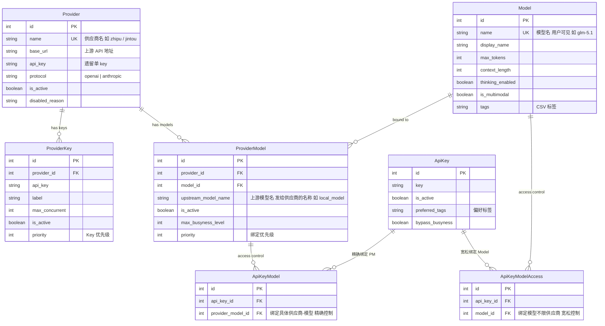
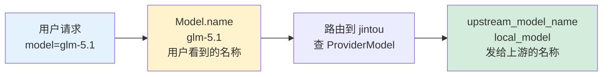
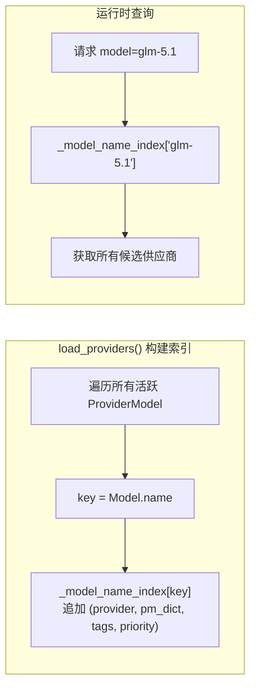
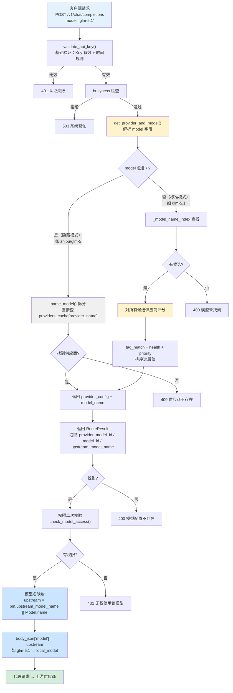
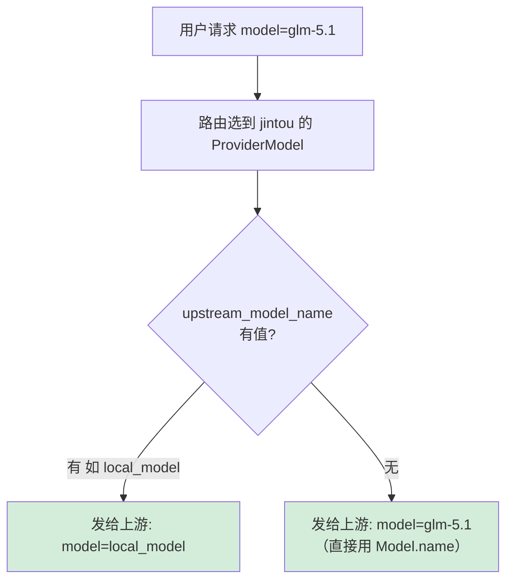
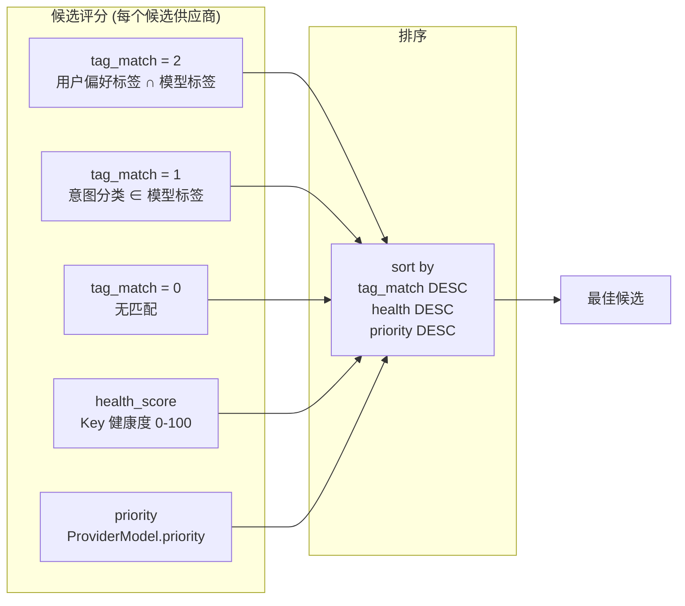
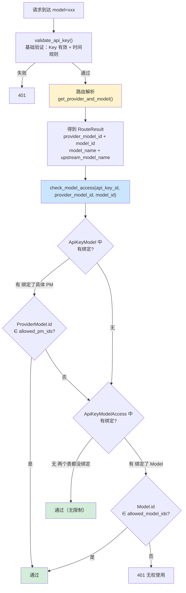
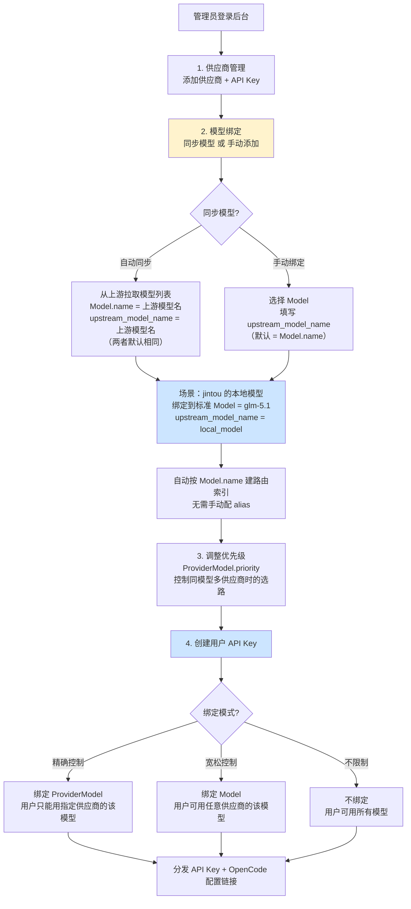
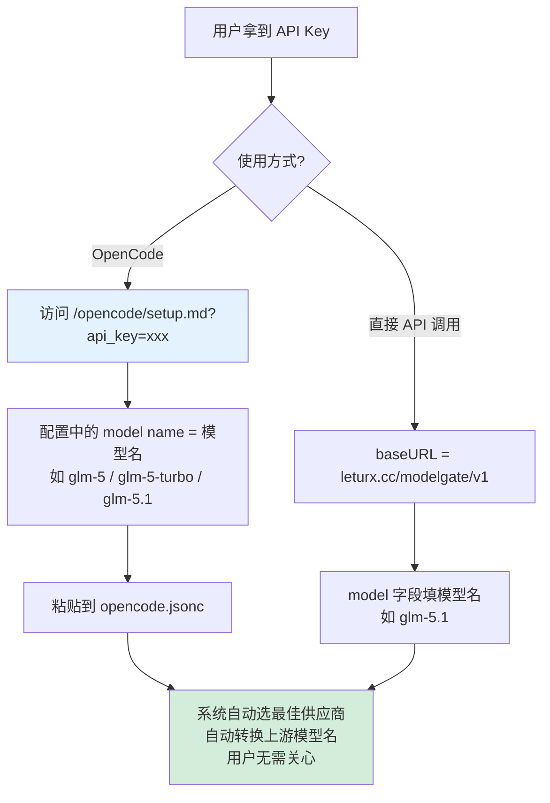

# 模型路由重构：去供应商化设计

## 需求

### 用户故事

**作为用户**，我只想用模型名（如 `glm-5`）来调用 API，不想知道背后是哪个供应商在提供服务。

**作为管理员**，我想给同一个模型绑定多个供应商（如 zhipu 和 deepseek 都提供 glm-5），系统自动选最佳的。有些供应商的上游模型名和我们的模型名不同（如 jintou 的 `local_model` 其实就是 `glm-5.1`），我需要配置这个映射。

**作为管理员**，给用户配 API Key 时，我希望能选择两种粒度：绑定具体供应商-模型（精确控制），或只绑定模型（不限供应商，宽松控制）。

### 功能需求

| # | 需求 | 优先级 |
|---|------|--------|
| R1 | 用户请求只用模型名（如 `glm-5`），系统自动路由到最佳供应商 | P0 |
| R2 | `provider/model` 格式（如 `zhipu/glm-5`）保留为隐藏调试模式，不在用户侧暴露 | P0 |
| R3 | `/v1/models` 返回模型名列表，按模型名去重，不暴露供应商 | P0 |
| R4 | OpenCode 配置生成用模型名，不带供应商前缀 | P0 |
| R5 | 管理员可配置"上游模型名"：用户请求 `glm-5.1`，发给 jintou 上游时转为 `local_model` | P0 |
| R6 | API Key 支持两种绑定粒度：按 Model（不限供应商）和按 ProviderModel（限具体供应商） | P1 |
| R7 | 所有路由模式都要在路由后校验 API Key 绑定权限（修复现有权限缺口） | P0 |
| R8 | Anthropic 兼容入口的模型列表与路由语义保持一致，不返回供应商前缀 | P1 |
| R9 | 统计、日志、监控同时记录用户请求模型、标准模型、上游模型、实际供应商 | P1 |
| R10 | 系统繁忙规则、用户目录页、后台模型解析页统一使用标准模型名作为用户侧标识 | P1 |

### 非功能需求

- 向后兼容：`provider/model` 格式继续可用（隐藏模式）
- 渐进迁移：分三阶段上线，兼容期不破坏现有用户

---

## 背景

当前系统以 `provider/model`（如 `zhipu/glm-5`）为主要的模型标识方式，用户需要知道供应商概念才能使用。同时 `ProviderModel.alias` 字段作为补充的路由方式，但需要手动配置且和模型名概念混淆。

**现有问题**：
- 对用户来说，供应商是内部实现细节，不应该暴露
- alias 和模型名是两个概念，增加理解成本
- API Key 绑定只能绑 ProviderModel，无法绑 Model（不限供应商）
- 别名路由时权限校验有缺口（`validate_api_key()` 对无 `/` 的模型名直接放行）
- `model_name_override` 字段语义不清，且代理时未正确使用（`proxy.py:283` 用 `Model.name` 而非 override 发给上游）
- `/v1/models`、Anthropic 兼容模型列表、OpenCode 配置、用户目录页和监控页面仍在不同程度暴露 `provider/model`
- 日志和统计现在主要围绕实际路由模型记录，难以稳定区分"用户请求的模型名"和"发给上游的模型名"

## 设计修订原则

1. **用户侧只认标准模型名**：公开 API、OpenCode 配置、用户目录、普通报错都使用 `Model.name`。
2. **供应商侧继续可观测**：管理员日志、监控、审计保留实际 `provider` 和 `upstream_model_name`，用于排障和成本分析。
3. **路由后统一鉴权**：先把用户请求解析成明确的路由结果，再用 `provider_model_id` 和 `model_id` 做权限校验，避免不同入口各自判断。
4. **迁移优先兼容，清理放最后**：第一阶段保留旧字段和旧输入格式，公开输出先切换为新格式；确认稳定后再删除 `alias` 和 `model_name_override`。

---

## 一、数据库模型



### 变更说明

1. **删除 `ProviderModel.alias` 字段** — 不再需要，统一用 `Model.name` 建索引
2. **新增 `upstream_model_name` 并替代 `model_name_override`** — 语义清晰：这就是发给上游供应商的模型名
3. **新增 `ApiKeyModelAccess` 表** — 支持按 Model 绑定（不限供应商）

### 三层模型名映射



| 层级 | 字段 | 示例 | 说明 |
|------|------|------|------|
| 用户侧 | `Model.name` | `glm-5.1` | 用户在请求中填的 model 值 |
| 绑定层 | `ProviderModel.upstream_model_name` | `local_model` | 发给上游供应商的 model 值 |

如果 `upstream_model_name` 为空，则直接用 `Model.name` 发给上游（大多数场景下两者相同）。

---

## 二、模型路由索引重构

### 之前：_alias_index（按 alias 建索引）

```
_alias_index["glm-5"] = [(zhipu, pm_dict, tags, priority), (deepseek, pm_dict, tags, priority)]
_alias_index["smart"] = [(zhipu, pm_dict, tags, priority)]
```

### 之后：_model_name_index（按 Model.name 建索引）

```
_model_name_index["glm-5"] = [(zhipu, pm_dict, tags, priority), (deepseek, pm_dict, tags, priority)]
_model_name_index["glm-5-turbo"] = [(zhipu, pm_dict, tags, priority)]
_model_name_index["glm-5.1"] = [(jintou, pm_dict, tags, priority)]
```



### 路由结果对象

当前 `get_provider_and_model()` 返回 `(provider_config, actual_model, provider_name)`，信息不足：

- 权限校验需要 `ProviderModel.id` 和 `Model.id`
- 上游转发需要 `upstream_model_name`
- 日志统计需要同时知道用户请求值、标准模型名、上游模型名、实际供应商

重构后建议返回明确的 `RouteResult`（可用 dataclass 或 TypedDict）：

```python
class RouteResult:
    provider_config: dict
    provider_name: str
    provider_id: int
    provider_model_id: int
    model_id: int
    requested_model: str        # 用户传入值，如 glm-5.1 或 zhipu/glm-5
    model_name: str             # 标准模型名，即 Model.name，如 glm-5.1
    upstream_model_name: str    # 发给上游的模型名，如 local_model
    is_forced_provider: bool    # 是否使用 provider/model 隐藏模式
```

### provider/model 隐藏模式解析规则

`provider/model` 继续兼容，但不作为公开推荐格式：

1. `zhipu/glm-5`：解析 provider 为 `zhipu`，模型部分先按 `Model.name` 匹配。
2. 如果未匹配，再按该供应商下的 `upstream_model_name` 匹配，兼容历史调用。
3. 匹配成功后仍返回标准 `model_name` 与 `model_id`，权限校验不直接信任请求字符串。
4. 匹配失败返回 `model_not_found`，不要退回默认供应商。

无 `/` 的标准模式只按 `_model_name_index[Model.name]` 查候选；如果找不到，也不要退回默认供应商。默认供应商回退会让拼错模型名变成错误路由，重构时应移除。

---

## 三、完整请求路由流程



### 模型名映射详解



**场景示例**：

| 用户请求 model | 路由到 | upstream_model_name | 发给上游 |
|---|---|---|---|
| `glm-5` | zhipu | _(空)_ | `glm-5` |
| `glm-5` | deepseek | `deepseek-chat` | `deepseek-chat` |
| `glm-5.1` | jintou | `local_model` | `local_model` |
| `zhipu/glm-5`（隐藏） | zhipu | _(空)_ | `glm-5` |

### 评分逻辑（不变）



---

## 四、API Key 权限校验（重构）

### 之前的问题

`validate_api_key()` 只在 `model` 包含 `/` 时检查 `allowed_provider_model_ids`，模型名路由直接放行。

### 之后：两层绑定 + 路由后校验



### 权限判断逻辑

```
1. 如果 ApiKeyModel 有绑定 → 检查 ProviderModel.id 是否在 allowed 中
   - 不在 → 再检查 ApiKeyModelAccess 中 Model.id 是否在 allowed 中
   - 都不在 → 拒绝
2. 如果只有 ApiKeyModelAccess 绑定 → 检查 Model.id 是否在 allowed 中
3. 如果两个都没绑定 → 允许所有（无限制模式）
```

### 权限校验接口

路由后的权限校验只接受 ID，不重新解析字符串：

```python
def check_model_access(
    key_info: dict,
    provider_model_id: int,
    model_id: int,
) -> bool:
    allowed_pm_ids = set(key_info.get("allowed_provider_model_ids") or [])
    allowed_model_ids = set(key_info.get("allowed_model_ids") or [])

    if not allowed_pm_ids and not allowed_model_ids:
        return True

    return provider_model_id in allowed_pm_ids or model_id in allowed_model_ids
```

设计要点：

- `validate_api_key()` 只做 Key 有效性、启用状态、时间规则校验，并返回 `key_info` 或 `api_key_id`。
- `proxy_request()` 和内部调用在拿到 `RouteResult` 后统一调用 `check_model_access()`。
- `provider/model` 隐藏模式、标准模型名模式、Anthropic 入站模式都走同一套校验。
- 如果 API Key 既绑定了具体 ProviderModel，又绑定了 Model，采用并集语义：任一命中即允许。
- 如果两个绑定表都为空，表示不限制模型访问。

---

## 五、/v1/models 接口（重构）

### 之前

```json
{
  "data": [
    {"id": "zhipu/glm-5", "object": "model", "owned_by": "zhipu"},
    {"id": "zhipu/glm-5-turbo", "object": "model", "owned_by": "zhipu"},
    {"id": "deepseek/glm-5", "object": "model", "owned_by": "deepseek"}
  ]
}
```

### 之后

```json
{
  "data": [
    {"id": "glm-5", "object": "model", "owned_by": "modelgate"},
    {"id": "glm-5-turbo", "object": "model", "owned_by": "modelgate"},
    {"id": "glm-5.1", "object": "model", "owned_by": "modelgate"}
  ]
}
```

- 按 `Model.name` 去重，每个模型只出现一次
- `owned_by` 统一为 `"modelgate"`
- 不暴露供应商信息
- 符合 OpenAI API 规范

### Anthropic 兼容入口

Anthropic 入站接口如果提供模型列表或内部映射，也必须使用相同的标准模型名集合：

- 对外返回 `Model.name`，不返回 `provider/model`
- 入站请求的 `model` 字段先转换为标准模型名，再进入同一套 `RouteResult` 路由
- 响应中的 `model` 字段优先回显用户请求的标准模型名，避免暴露上游模型名

---

## 六、OpenCode 配置（重构）

### 之前

```json
{
  "models": {
    "zhipu/glm-5": {"name": "zhipu/glm-5", ...},
    "zhipu/glm-5-turbo": {"name": "zhipu/glm-5-turbo", ...}
  }
}
```

### 之后

```json
{
  "models": {
    "glm-5": {
      "name": "glm-5",
      "modalities": {"input": ["text"], "output": ["text"]},
      "limit": {"context": 131072, "output": 16384},
      "options": {"thinking": {"type": "enabled"}}
    },
    "glm-5-turbo": {
      "name": "glm-5-turbo",
      "modalities": {"input": ["text"], "output": ["text"]},
      "limit": {"context": 131072, "output": 16384}
    }
  }
}
```

- key 和 name 都用模型名，不带供应商前缀
- 同名模型多供应商时，取优先级最高的供应商的模型参数（context_length, max_tokens 等）

---

## 七、管理员配置流程



### 管理员配置模型绑定详解

```mermaid
flowchart TD
    subgraph "场景1: 标准供应商（如 zhipu）"
        A1["同步模型 → 上游返回 glm-5"] --> B1["自动创建:<br/>Model.name = glm-5<br/>upstream_model_name = glm-5"]
        B1 --> C1["用户请求 model=glm-5<br/>发给上游 model=glm-5 ✓"]
    end

    subgraph "场景2: 本地/自定义供应商（如 jintou）"
        A2["同步模型 → 上游返回 local_model"] --> B2["自动创建临时绑定:<br/>Model.name = local_model<br/>upstream_model_name = local_model"]
        B2 --> C2["管理员重新绑定到标准模型:<br/>Model.name = glm-5.1<br/>upstream_model_name = local_model"]
        C2 --> D2["用户请求 model=glm-5.1<br/>发给上游 model=local_model ✓"]
    end

    subgraph "场景3: 同模型多供应商"
        A3["zhipu 绑 glm-5<br/>deepseek 绑 glm-5"] --> B3["两个 ProviderModel<br/>Model.name 都是 glm-5"]
        B3 --> C3["用户请求 model=glm-5<br/>按 priority/health 选最佳供应商"]
    end

    style C1 fill:#d4edda
    style D2 fill:#d4edda
    style C3 fill:#d4edda
```



### 管理员侧重点变化

| 之前 | 之后 |
|------|------|
| 需要给用户解释供应商概念 | 用户只看到模型名 |
| 需要手动配 alias | 自动按模型名索引 |
| `model_name_override` 语义不清 | `upstream_model_name` 明确表示发给上游的名称 |
| 只能绑 ProviderModel | 可选绑 Model 或 ProviderModel |
| provider/model 是主模式 | provider/model 是隐藏模式 |
| 同步后模型名就是上游名 | 同步后可重新绑定到标准 Model，并保留 upstream_model_name |

> 注意：`Model.name` 是全局唯一的标准模型名。对于同步出来的本地/自定义上游模型，推荐提供"重新绑定到标准模型"操作：保留 `upstream_model_name=local_model`，把 `ProviderModel.model_id` 指向已有或新建的标准 `Model.name=glm-5.1`。不要把共享 Model 随意改名，避免影响其他供应商绑定。

---

## 八、用户使用流程



### 请求示例

```bash
# 标准用法（用户侧）
curl https://leturx.cc/modelgate/v1/chat/completions \
  -H "Authorization: Bearer mg_xxx" \
  -d '{"model": "glm-5.1", "messages": [{"role": "user", "content": "你好"}]}'
# → 路由到 jintou，上游收到 model=local_model

# 隐藏模式（调试/强制指定供应商）
curl https://leturx.cc/modelgate/v1/chat/completions \
  -H "Authorization: Bearer mg_xxx" \
  -d '{"model": "zhipu/glm-5", "messages": [{"role": "user", "content": "你好"}]}'
```

---

## 九、变更清单

### 数据库变更

| 变更 | 说明 |
|------|------|
| 删除 `ProviderModel.alias` 列 | 不再需要 alias 概念 |
| `model_name_override` → `upstream_model_name` | 新增清晰字段、回填旧值，稳定后删除旧字段 |
| 新增 `ApiKeyModelAccess` 表 | `(api_key_id, model_id)` 支持按 Model 绑定 |

### 后端变更

| 文件 | 变更 |
|------|------|
| `app/core/database.py` | 新增 upstream_model_name，兼容读取 model_name_override，删除 alias 列，新增 ApiKeyModelAccess 模型，init_db 迁移 |
| `app/services/provider.py` | `_alias_index` → `_model_name_index`，用 Model.name 建索引；pm_dict 中 `model_name` → `upstream_model_name` |
| `app/services/auth.py` | validate_api_key() 简化：只做基础验证，移除模型权限检查 |
| `app/services/proxy.py` | line 283: `body_json["model"]` 改用 `model_config["upstream_model_name"]`；新增 check_model_access() 权限二次校验 |
| `app/routes/proxy.py` | `/v1/models` 按模型名去重，owned_by="modelgate" |
| `app/routes/anthropic_proxy.py` | Anthropic 入站模型列表、响应模型名回显适配标准模型名 |
| `app/routes/opencode.py` | build_opencode_config() 用模型名替代 provider/model |
| `app/routes/provider_models.py` | 移除 alias 相关字段，model_name_override → upstream_model_name（兼容期双读双写） |
| `app/routes/keys.py` | 新增 ApiKeyModelAccess 绑定管理 |
| `app/routes/models.py` | resolve 端点适配新索引 |
| `app/services/proxy_runtime/internal.py` | 内部调用适配新字段名 |
| `app/routes/user.py` | 用户面板适配新字段名 |
| `app/routes/stats.py`、`app/services/stats_aggregator.py` | 聚合标准模型名，同时保留 provider 维度 |
| `app/routes/system_config.py` | 系统繁忙规则的 target_models 改用标准模型名 |
| `app/services/usage_report.py`、`app/services/weixin.py` | 内部模型选择和调用适配标准模型名 |

### 前端变更

| 文件 | 变更 |
|------|------|
| 供应商模型绑定页 | 移除 alias 输入框，`model_name_override` → `upstream_model_name`，标签改为"上游模型名" |
| API Key 编辑页 | 支持两种绑定模式切换（按模型 / 按供应商-模型） |
| 用户目录页 | 模型列表只显示模型名，不显示供应商 |
| OpenCode 配置页 | 模型名不带供应商前缀 |
| 监控/统计页 | 普通模型维度显示标准模型名；管理员排障区域可显示 provider 与 upstream_model |

### 日志变更

| 文件 | 变更 |
|------|------|
| `app/services/logging.py` | 日志中 requested_model 记录用户传入值，model/model_name 记录标准模型名，upstream_model 记录发给上游的名称，provider 记录实际路由到的供应商 |

### 统计字段约定

为避免旧字段语义继续混淆，建议统一如下：

| 字段 | 含义 | 示例 |
|------|------|------|
| `requested_model` | 用户请求中的原始 model 值 | `glm-5.1` / `zhipu/glm-5` |
| `model` 或 `model_name` | 标准模型名，用于用户侧统计聚合 | `glm-5.1` |
| `upstream_model` 或 `upstream_model_name` | 发给上游供应商的模型名 | `local_model` |
| `provider` / `provider_id` | 实际路由到的供应商 | `jintou` |

普通用户界面默认展示 `model_name`；管理员监控、请求日志详情可同时展示 `provider` 和 `upstream_model_name`。

---

## 十、迁移策略

### Phase 1: 兼容期

- 新增 `upstream_model_name` 字段，与 `model_name_override` 双写/双读
- 新增 `ApiKeyModelAccess` 表，并把权限信息加载进 API Key 缓存
- 新增 `_model_name_index` 与现有 `_alias_index` 并存，路由结果统一返回 `RouteResult`
- 标准模型名请求和 `provider/model` 隐藏模式都改为路由后权限校验
- 公开 `/v1/models`、Anthropic 模型列表、OpenCode 配置优先输出新格式（标准模型名）
- 旧 `provider/model` 请求继续接受，但不再作为公开列表或配置推荐值
- API Key 绑定同时支持两种表
- 统计和日志开始写入标准模型名、requested_model、upstream_model_name、provider

### Phase 2: 切换

- `_model_name_index` 成为主索引
- `/v1/models` 切换为新格式
- OpenCode 配置切换为新格式
- proxy.py 发给上游改用 upstream_model_name
- 用户目录页、系统繁忙规则、后台模型解析页切换到标准模型名
- API Key 编辑页提供"不限制 / 按模型 / 按供应商-模型"三态，并集权限语义生效
- 监控和统计页面完成字段语义调整

### Phase 3: 清理

- 删除 `ProviderModel.alias` 列
- 删除旧 `model_name_override` 列，只保留 `upstream_model_name`
- 删除 `_alias_index`
- 清理旧代码路径
- 删除公开文档和 UI 中的 `provider/model` 推荐用法，仅在管理员调试说明中保留

### 数据迁移 SQL

```sql
-- 1. 将 alias 值迁移到 _model_name_index（代码层面自动处理）

-- 2. Phase 1 新增字段并双写/双读
ALTER TABLE provider_models ADD COLUMN IF NOT EXISTS upstream_model_name VARCHAR(100);

UPDATE provider_models
SET upstream_model_name = model_name_override
WHERE upstream_model_name IS NULL
  AND model_name_override IS NOT NULL;

-- 3. Phase 3 清理旧字段前，确认 upstream_model_name 已完整回填
ALTER TABLE provider_models DROP COLUMN IF EXISTS model_name_override;

-- 4. 创建 ApiKeyModelAccess 表
CREATE TABLE IF NOT EXISTS api_key_model_access (
    id SERIAL PRIMARY KEY,
    api_key_id INTEGER NOT NULL REFERENCES api_keys(id),
    model_id INTEGER NOT NULL REFERENCES models(id),
    UNIQUE(api_key_id, model_id)
);

CREATE INDEX IF NOT EXISTS idx_api_key_model_access_api_key_id
ON api_key_model_access (api_key_id);

CREATE INDEX IF NOT EXISTS idx_api_key_model_access_model_id
ON api_key_model_access (model_id);
```

### 迁移注意事项

- Phase 1 不直接删除 `alias`，但新建/编辑 ProviderModel 时不再鼓励填写 alias。
- 对已有 `alias`，可作为一次性迁移辅助：如果 `alias` 与某个 `Model.name` 相同，则自动纳入 `_model_name_index`；否则仅作为兼容别名读取，不进入公开模型列表。
- 对已有 `model_name_override`，迁移到 `upstream_model_name` 时保持原值；如果为空，上游模型名等于 `Model.name`。
- 对已有 API Key 的 `ApiKeyModel` 绑定保持不变；管理员主动切换后才写入 `ApiKeyModelAccess`。
- 回滚策略：Phase 1 和 Phase 2 均保留旧输入格式，回滚时只需恢复公开输出为旧格式；Phase 3 涉及删列/重命名，必须在生产验证稳定后单独执行。

---

## 十一、未来方向（暂不实现）

1. **标签路由**: 请求 `model="auto"` 时根据标签自动从全局模型池选最佳
2. **模型分组**: 给模型分组（如"代码"、"写作"），用户按分组选择
3. **用户侧自定义别名**: 允许用户给自己的 API Key 配模型别名
